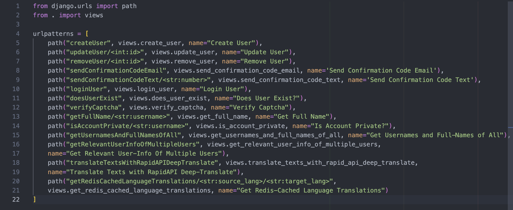
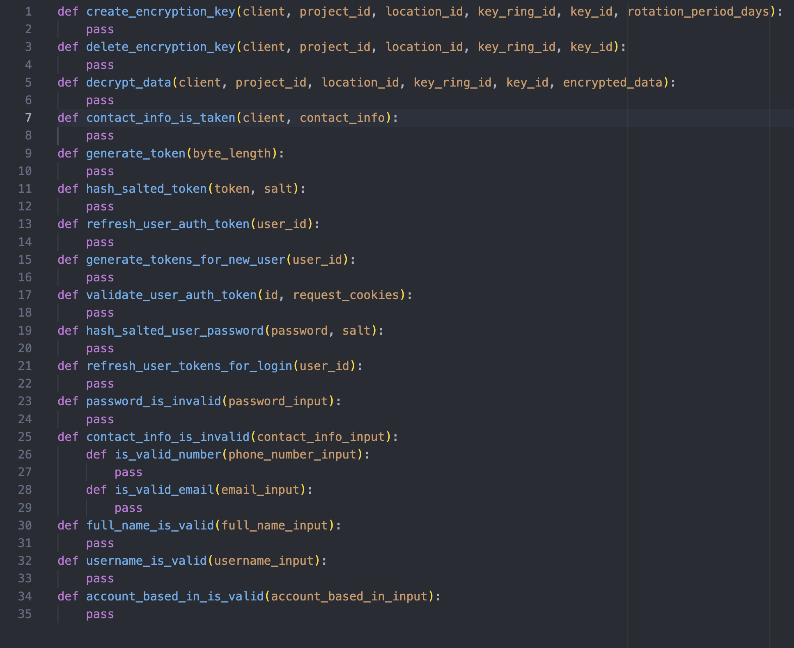
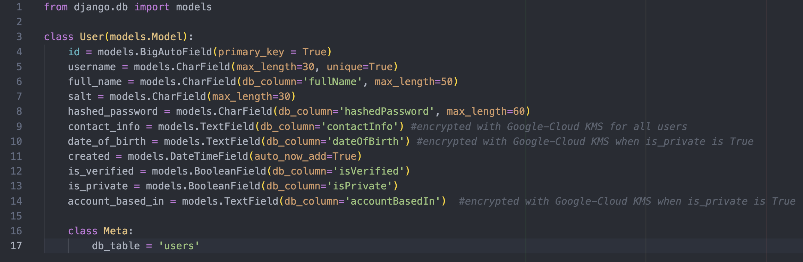

# Login-Register
  This GitHub repository contains code that powers both the <b>frontend & backend</b> of <b>logging in and registering
  users</b> into <b>Megagram</b>. Megagram is a blend of some of the features of <b>Instagram and Amazon</b>, combined into a single website. It was created by me, <b>Rishav Ray</b>, as a personal project to <b>acquire and then showcase</b> my skills.

  Because a major portion of the project depends on <b>the cloud</b>, in order to <b>save costs</b> on that, I <b>only activate</b> my frontend, backend and data/cloud-services for about 1-2 days max upon request(<b>my contact-info is presented in the bottom-section</b>), assuming that there isn't too many cloud-services also running at the time. <b>Once they're activated</b>, you should know that the frontend-urls begin with https://megagram.com/loginregister/, and the backend-urls with https://megagram.com/loginregister/api/.

  If you so choose, you can use the <b>username 'testuser'</b> and the <b>password 'IamTESTINGMegagram1!!'</b> to login to Megagram as an actual user(although <b>you won't be able to edit/delete</b> this account of-course).

  Welcome aboard!


## Table of Contents
  0. [Project Disclaimers](#project-disclaimers)
  1. [Key Details of Frontend](#key-details-of-frontend)
  2. [Key Details of Backend](#key-details-of-backend)
  3. [Key Details of Data](#key-details-of-data)
  4. [Key Details of Cloud](#key-details-of-cloud)
  5. [Running the Frontend and Backend](#running-the-frontend-and-backend)
  6. [Video of Frontend](#video-of-frontend)
  7. [Video of Backend](#video-of-frontend)
  8. [Finale(My Contact Info is Here)](#finale)


## Project Disclaimers
  Because this project wasn't done as part of a job/business, focusing on every single detail is <b>unneccessary</b>. Here is a list of some of the <b>main things</b> in this project that have been done in this project for the <b>sake of convenience and simplicity rather than for actual effectiveness</b>.

  * The 'users' MySQL table is hosted on my <b>local Macbook instead of the cloud</b>. This doesn't mean that none of
  of this project's tables/collections/etc are in the cloud, however, because <b>a lot</b> of them are!

  * In one of the steps for registering users, users have to <b>enter a code that was sent to their phone-number/email</b>. For the sake of simplicity, I enabled the backend to not store the confirmation-code anywhere and instead return the confirmation-code after sending the text/email; therefore, the <b>frontend has access to the confirmation-code</b>. Furthermore, users can directly make requests to <b>/createUser and /updateUser</b> and set any contact-info(so long as it is in the format of a valid number/email and isn't taken by someone else) they would like <b>without any confirmation-code-validation</b>. On the bright side, <b>nothing</b> sensitive is accessible to the frontend <b>besides the confirmation-code!</b> 

  * <b>Instead of using the conventional JSON Web tokens</b> for verifying that users have logged in, I used something somewhat different that achieves the same goal- I generate <b>authTokens and refreshToken</b> for users that are <b>extremely challenging to crack</b> with brute-force-attacks.
  
  * The authToken lasts for <b>45 min</b> and the refreshToken lasts for <b>a week</b>. Both are stored
  in HTTP-only same-site-strict cookies and the authTokens and refreshTokens aren't stored in plaintext in the database;
  instead they are salted and hashed and the hashedAuthToken, hashedAuthTokenSalt, hashedRefreshToken, and hashedRefreshTokenSalt are stored in the database. This comes with the disadvantage, however, that a <b>user can only be logged in at-most one browser at a time</b>. However, users can indeed be logged into <b>multiple separate accounts simultaneously</b>.

  * In order <b>to save money on the cloud</b>, the website will <b>only be run on demand</b>. Furthermore, although auto-scaling is enabled in the Google Cloud MySQL spanner and in the GKE-Clusters, the max-nodes/etc is usually set to a very low number like 1 or 2(which obviously <b>defeats the purpose of autoscaling</b> for software in the real world). Furthermore, my AWS-Redis account is on a free tier(hence there are <b>storage and request-limits much lower</b> than what actual software companies have when they use Redis-cloud). The rate-limits on most of the backend endpoints are <b>lower than normal</b> for this exact reason(to reduce money spent on the cloud).


## Key Details of Frontend
  * The frontend is powered by <b>Python Django</b> and is located in the <b>login_register_frontend</b> directory in this Github repo.

  * Inside login_register_frontend will be my_app, which contains the static folder and the templates folder neccessary
  for this project. Templates are written in <b>HTML, and static includes JavaScript-files, CSS-files, an images folder,
  and a fonts folder</b>. 

  * There are <b>four endpoints</b>: /login, /signup, /ageCheck, and /confirmCode. All the endpoints start with https://megagram.com/loginregister/. 

  * Each of the frontend pages work for both <b>dark-mode and light-mode of the system</b>, and have been <b>successfully tested</b> across the <b>top 5 most popular browsers</b> and across the <b>different screen-sizes</b> provided by Google-Chrome Dev-Tools.

  * The JavaScript utilizes <b>JQuery</b> to a significant extent due to its <b>concise syntax and grand popularity</b> in the world of web-frontends.

  * The frontend utilizes <b>Google-Cloud for its reCaptcha and OAuth services</b>. Specifically, it utilizes
  reCaptcha to verify that <b>user-login-attempts aren't done by a robot</b>. The OAuth services give users
  the ability to create accounts and login to Megagram <b>via their Google account</b>.

  * You can append <b>?language=Italiano or ?language=日本語</b> to the URL to trigger backend calls for <b>translations via a language-translation API</b>. For translations that are already cached in Redis, the backend directly returns that instead of spending money and API-usage-tokens on the RapidAPI DeepTranslate API Service. 

  * Whenever the user tries to access an endpoint in the frontend that <b>does not exist</b>, they will come across a <b>'Page-Not-Found'</b> page that is very well styled. It was created by an <b>impeccable Graphics designer</b> and the styling is <b>very exquisite and complex</b>, but I was able to <b>alter</b> the HTML/JS/CSS just a bit so that it <b>fits the 'Megagram' brand</b>.


## Key Details of Backend
  * The backend is powered by <b>Python Django</b> and is located in the <b>login_register_backend</b> directory in this Github repo. It supports the methods <b>'GET', 'POST', 'PATCH', & 'DELETE'</b>.

  * There are <b>14 endpoints</b>, presented in the screenshot below. All the endpoints start with https://megagram.com/loginregister/api/. 

  

  * The backend utilizes <b>rate-limiting on each one of its endpoints</b>(and the rates <b>can vary</b> per endpoint). For instance, some endpoints(specifically /updateUser, /removeUser, and /loginUser) have rate-limits <b>much lower</b> than the other endpoints for the <b>sake of security- 5 per hour</b> based on ip-address and user-id. This is because the <b>/updateUser and /removeUser endpoints both require user-auth-tokens</b> and keeping the limit low makes brute-force-attacks much less likely to work. Similarly, For <b>/loginUser, users need to send in the correct password</b>, and keeping the limit low significantly hinders brute-force-attacks. 

  * For the usersTable, the backend uses a <b>Django model(User) and serializer(UserSerializer)</b>. For accessing the userAuthTokens table it uses a <b>google-cloud-mysql-spanner client</b>. For accessing the <b>'Usernames and their Info'</b> Redis hashset, it uses the <b>Redis-connection that was configured in settings.py</b> as the default(which is also used by Django for rate-limiting).

  * The <b>/updateUser, and /removeUser</b> endpoints both <b>require user-auth-tokens</b> to proceed. The <b>/createUser</b> endpoint provides the newly-created user the user-auth-tokens to proceed(i.e it <b>creates the account and logs in</b> the user on their browser). The <b>/loginUser</b> endpoint enables the user to log in by refreshing their userAuthToken and userRefreshToken and setting their HTTP-only, same-site-strict cookies; logins only work if the provided password by the user to the endpoint is correct.

  * For <b>encrypting/decrypting user-data</b>(specifically the '<b>contactInfo</b>' for all users, and the '<b>accountBasedIn</b>' and '<b>dateOfBirth</b>' for users with isPrivate set to True), the backend uses <b>Google-Cloud Key-Management-Service</b>. Specifically, it uses a global key-ring called '<b>usersTableMySQL</b>'; each row in the 'users' Table corresponds to an id(which is an integer representing the user-id), and the <b>stringified id is used as the key-id for encrypting and decrypting the specific columns of each user-row</b>.

  * There are <b>18 helper methods</b> in the backend that are not directly accessible via the Rest API but are used by the methods that are accessible via the Rest API. For the sake of organization of views.py, <b>first all the Rest API methods are listed</b> and <b>then all the helper-methods</b>. Below is a screenshot of the <b>names and parameters of all 18 helper-methods</b>.

  


## Key Details of Data
  * For this repository, there's one <b>locally-hosted MySQL table called 'users'</b>; one MySQL table hosted via <b>Google Cloud MySQL-Spanner called 'userAuthTokens'</b>; there's also an <b>AWS-Redis cache for three purposes in this website</b>. More on that later in this section. 

  * The <b>'users' table</b> has fields that can be described in the screenshot below. Users must be <b>at-least 10 years of age</b> and the accountBasedIn field must be either <b>a US-State, a country, or 'N/A'/'Temporary'</b>. The password must pass a <b>strength test</b> and is only stored in the database after salting and hashing it(i.e user passwords are <b>not stored as plaintext</b>). 
    

  * The 'userAuthTokens' table has the following fields: <b>hashedAuthToken(45-character-string), authTokenSalt(45-character-string), hashedRefreshToken(45-character-string), hashedRefreshTokenSalt, authTokenExpiry(timestamp), and refreshTokenExpiry(timestamp)</b>. Auth tokens(last 45 min) are used in cookies and backend-servers to <b>prove authentication</b> required for certain requests(<b>i.e updating/deleting an account</b>), and refresh-tokens(last 7 days and also used in cookies) are used to <b>refresh auth-tokens that have expired</b>. Once both the refresh token and auth token are expired, the user needs to re-login.
  
  * The <b>three purposes of AWS-Redis for Login-Register are as follows</b>: (1) For <b>rate-limiting</b> all the different endpoints of the backend. (2) For using hash-sets named something like <b>'Translations from English to Español'</b> which stores key-value pairs
  where keys are English words and values are their Spanish translations. This is used by the frontend for translating the website; this hash-set <b>aids in efficiency and reducing money/usage-tokens spent</b> when making requests to the Rapid-API Deep-Translate API service. (3) For using the hash-set <b>'Usernames and their Info'</b> which contains keys that are usernames of Megagram-users and values that are stringified dicts that contain their info(i.e all the other fields of the user in the 'users' table). This hash-set enables <b>efficiency in fetching user-info</b>.


## Key Details of Cloud
  * For the Login-Register part of Megagram, the only cloud-service-provider used is <b>GCP(Google Cloud Platform)</b>.

  * GCP is used by the frontend for <b>reCaptcha and OAuth</b>, and by the backend for <b>encrypting/decrypting sensitive columns</b> of the 'users' table with the help of Google-Cloud <b>Key-Management-Service</b>(and the keys are all <b>rotated automatically every 70 days</b>). 

  * GCP is used for the <b>GKE(Google-Kubernetes-Engine) Cluster</b>, where the <b>auto-scaling and loadbalancing of Kubernetes pods</b> for both the frontend and backend <b>takes place</b>. You can find the actual Docker repositories in Docker Hub under <b>rishavry/login-register-backend and rishavry/login-register-frontend</b>.

  * Last, but not least, GCP is used for the <b>Managed Instance Group(MIG) called 'megagram-server-group'</b>. This MIG has <b>auto-scaling enabled</b> and each instance in this group has a <b>startup-script(located in this repo as megagram-server-startup.sh)</b> that uses nginx to handle traffic at port 443. The nginx routes requests with <b>/loginregister/ and /loginregister-api/ to the load-balancers in the GKE Cluster</b> mentioned in the earlier point. the This MIG has a load-balancer that maps to port 443 of each instance in the MIG, and the ip-address of this load-balancer is the one that is <b>directly associated</b> with https://megagram.com!


## Running the Frontend and Backend
  <b>Because Code Reproducibility is Very Important!</b>

  If you would like to run a <b>development-server/production-server of the frontend</b> on your own machine/VM/container/etc, follow these steps:

  `0.`  <b>Ensure that you have the environment-variables set</b> for LOGIN_REGISTER_FRONTEND_DJANGO_SECRET_KEY(to any string) and ALLOWED_HOST(to 'localhost' perhaps).

  `1.` (optional) In terminal, activate a <b>python virtual environment</b>.

  `2.` Run the following terminal-command:
  ```bash 
    git clone https://github.com/MegaGramProject/Login-Register.git
  ```

  `3.` Run the following terminal-command:
  ```bash 
      cd Login-Register/login_register_frontend
  ```

  `4.` Run the following terminal-command:
  ```bash
  pip install --no-cache-dir -r requirements.txt
  ```

  `5.` Run the following terminal-command(feel <b>free to replace 8000 with another available port</b>) for the <b>Development Server</b>:
  ```bash 
      python manage.py runserver 8000
  ```
  For the <b>Production Server</b>, use this command <b>instead</b>(feel <b>free to replace 8000 with another available port</b>):
  ```bash 
    gunicorn --workers 4 --bind 0.0.0.0:8000 login_register_frontend.wsgi:application
  ```

  --------

  If you would like to run a <b>development-server/production-server of the backend</b> on your own machine/VM/container/etc, follow these steps:

  `0.`  <b>Ensure that you have the environment-variables set</b> for LOGIN_REGISTER_BACKEND_DJANGO_SECRET_KEY(to any string), ALLOWED_HOST(to 'localhost' perhaps), LOCAL_MYSQL_USER, LOCAL_MYSQL_PASSWORD, GOOGLE_APPLICATION_CREDENTIALS(to the path of your Google-Cloud-Services-Credentials-JSON-file), EMAIL_SENDER_AUTH_TOKEN, TWILIO_ACCOUNT_SID, TWILIO_AUTH_TOKEN, TWILIO_PHONE_NUMBER, AWS_REDIS_PASSWORD, DEEP_TRANSLATE_API_KEY, LOCAL_MYSQL_HOST_VIA_NGROK(to 'localhost' perhaps), & GOOGLE_RECAPTCHA_SECRET.

  `1.` (optional) In terminal, activate a <b>python virtual environment</b>.

  `2.` Run the following terminal-command:
  ```bash 
    git clone https://github.com/MegaGramProject/Login-Register.git
  ```

  `3.` Run the following terminal-command:
  ```bash 
      cd Login-Register/login_register_backend
  ```

  `4.` Run the following terminal-command:
  ```bash
  pip install --no-cache-dir -r requirements.txt
  ```

  `5.` Run the following terminal-command(feel <b>free to replace 8001 with another available port</b>) for the <b>Development Server</b>:
  ```bash 
      python manage.py runserver 8001
  ```
  For the <b>Production Server</b>, use this command <b>instead</b>(feel <b>free to replace 8001 with another available port</b>):
  ```bash 
    gunicorn --workers 4 --bind 0.0.0.0:8001 login_register_backend.wsgi:application
  ```

  --------

  If you prefer to use <b>Docker/Kubernetes instead</b>, here are the steps for that. 

  `0.` Run the following terminal-command for the <b>backend production-server</b>:
  ```bash 
    docker pull rishavry/login-register-backend:v4
  ```

  <b>OR</b> if you would like to use the <b>frontend production-server</b>:
  ```bash 
    docker pull rishavry/login-register-frontend:v2
  ```
  
  `1.` Run the following terminal-command to <b>run the backend production-server at port 8000 in your host</b>:

  ```bash 
  docker run \
    -v /path/to/google/credentials/file/in/host:/path/to/google/credentials/file/in/container \
    -e LOGIN_REGISTER_BACKEND_DJANGO_SECRET_KEY='any string' \
    -e LOCAL_MYSQL_USER='INSERT HERE' \
    -e LOCAL_MYSQL_PASSWORD='INSERT HERE' \
    -e ALLOWED_HOST=localhost \  # Or replace with the IP address of the host if it is not localhost
    -e GOOGLE_APPLICATION_CREDENTIALS='/path/to/google/credentials/file/in/container' \
    -e EMAIL_SENDER_AUTH_TOKEN='INSERT HERE' \
    -e TWILIO_ACCOUNT_SID='INSERT HERE' \
    -e TWILIO_AUTH_TOKEN='INSERT HERE' \
    -e TWILIO_PHONE_NUMBER='INSERT HERE' \
    -e AWS_REDIS_PASSWORD='INSERT HERE' \
    -e DEEP_TRANSLATE_API_KEY='INSERT HERE' \
    -e LOCAL_MYSQL_HOST_VIA_NGROK='localhost' \  # Feel free to change 'localhost' if that is not the host of your Local MySQL 'users' table
    -e GOOGLE_RECAPTCHA_SECRET='INSERT HERE' \
    -p 8000:8000 \  # Feel free to replace the first 8000 with any available host port
    rishavry/login-register-backend:v4
  ```

  <b>Or</b> if you would like to <b>run the frontend production-server at port 8001 in your host</b>:

  ```bash 
  docker run \
    -e LOGIN_REGISTER_FRONTEND_DJANGO_SECRET_KEY='any string' \
    -e ALLOWED_HOST=localhost \ # Or replace with the ip-address of the host if it is not localhost
    -p 8001:8001 \ # Feel free to replace the first 8001 with any available host port
    rishavry/login-register-frontend:v2
  ```


## Video of Frontend
  <video src="./README_imgs_&_vids/videoOfFrontend.mp4" controls></video>


## Video of Backend
  <video src="./README_imgs_&_vids/videoOfBackend.mp4" controls></video>


## Finale
  Thank you for sticking around till the end! Hope you found what you were looking for. Whether you did or did not, feel free to reach out to me using any of the following methods:

  * Email: rishavray422@gmail.com

  * Number(texting only): <span style="color:#03b6fc">608-443-7805</span>

  * Linkedin: https://www.fakelink.com